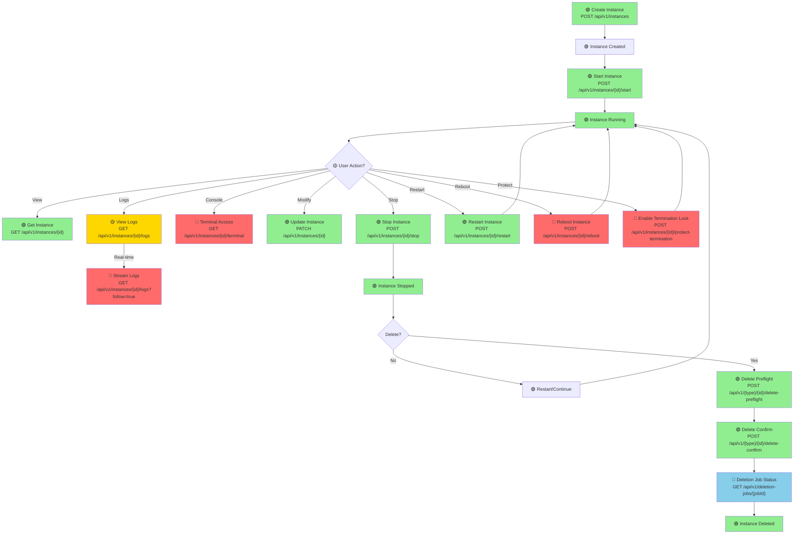
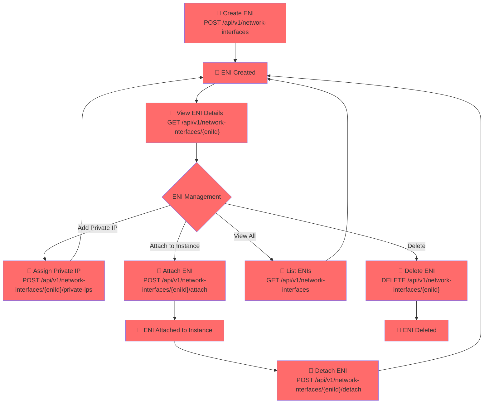
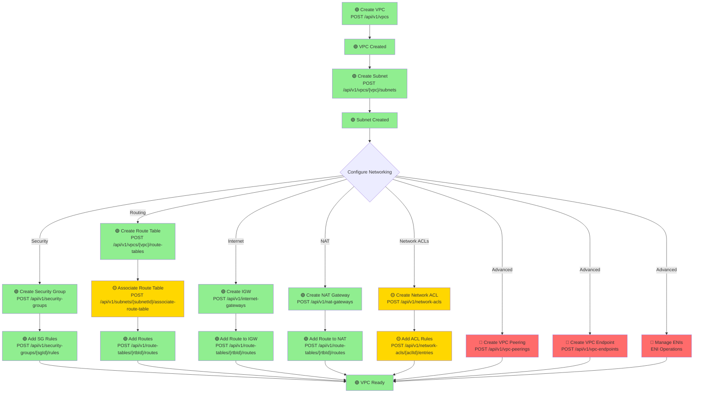
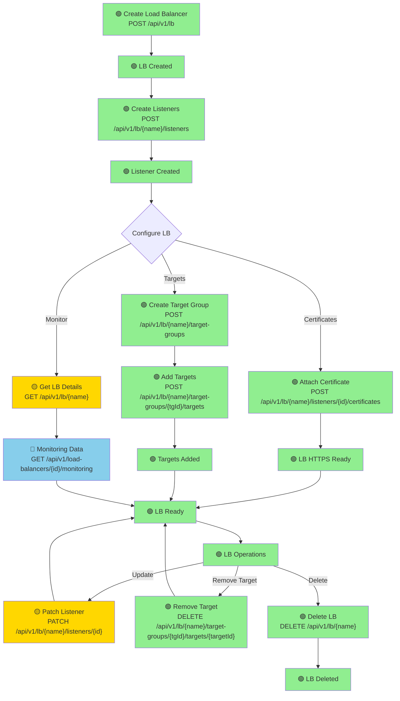
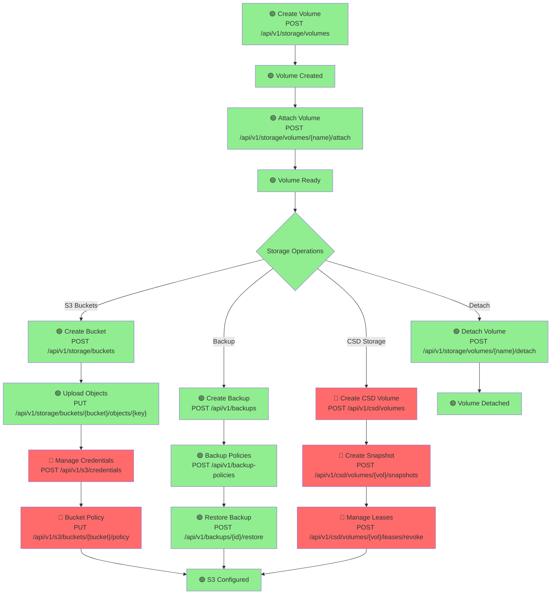
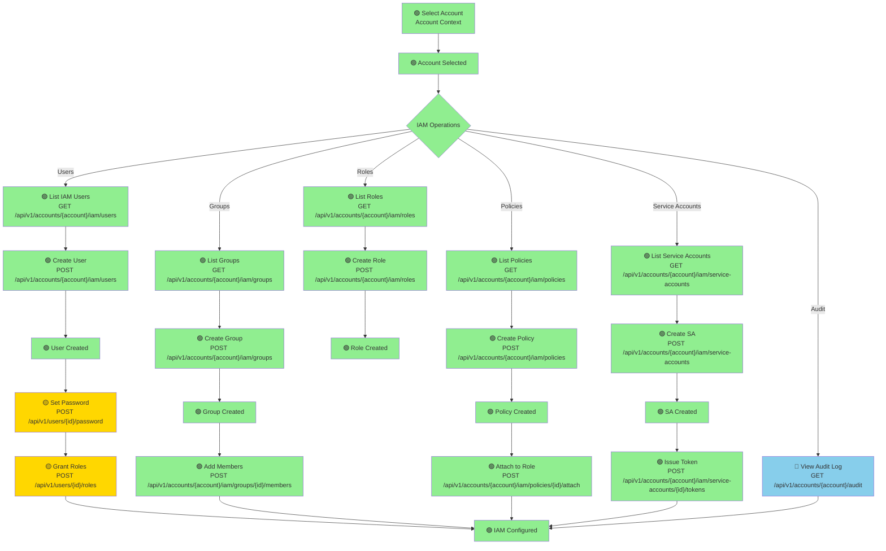
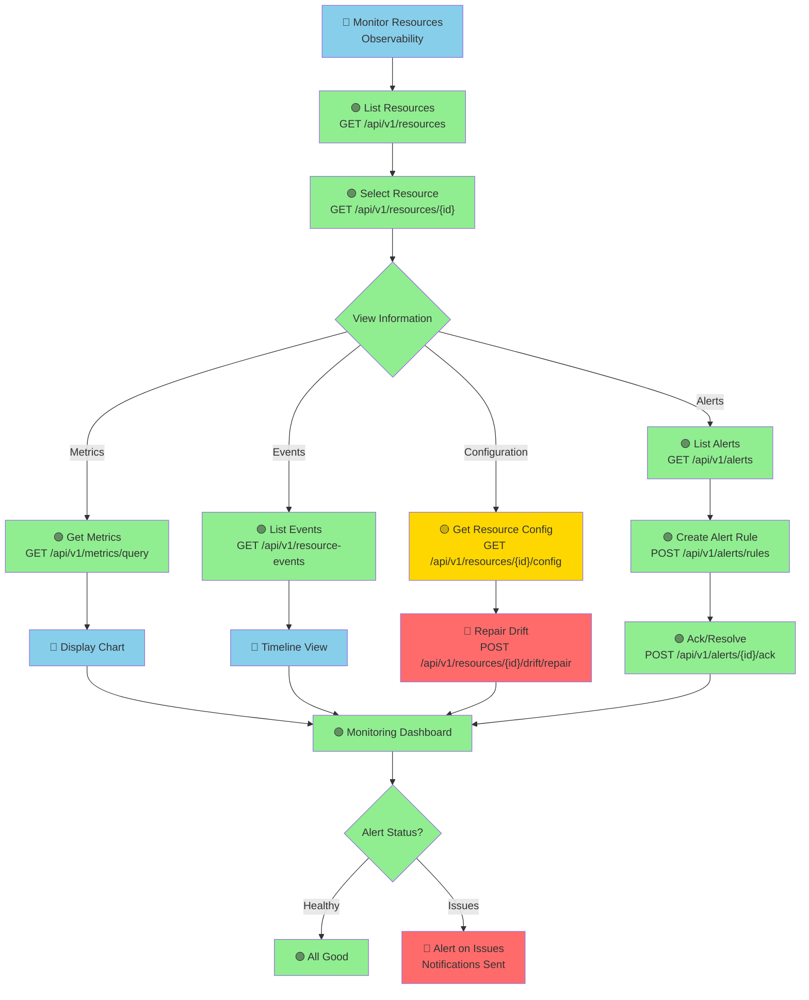
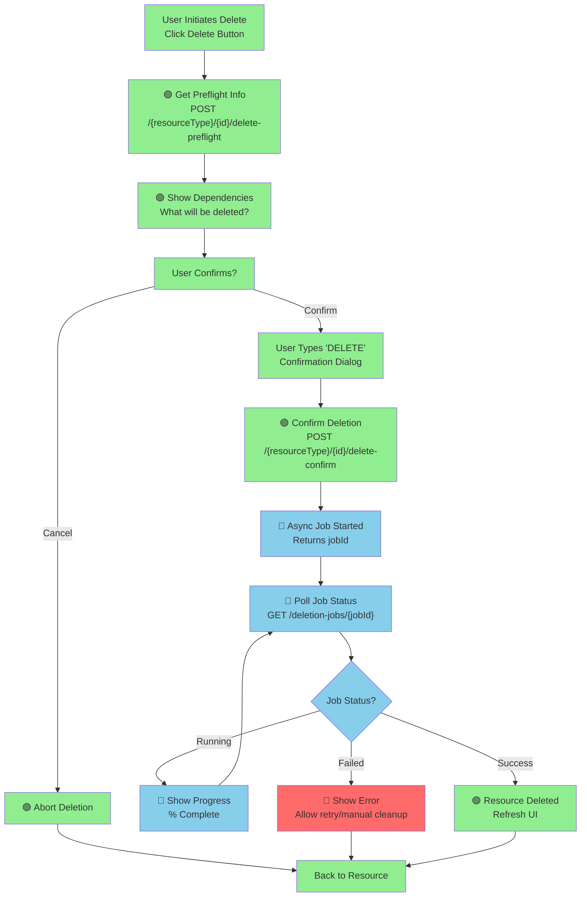
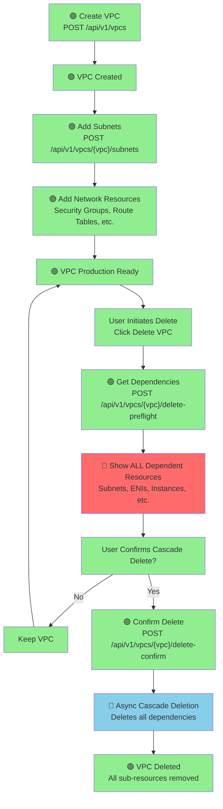
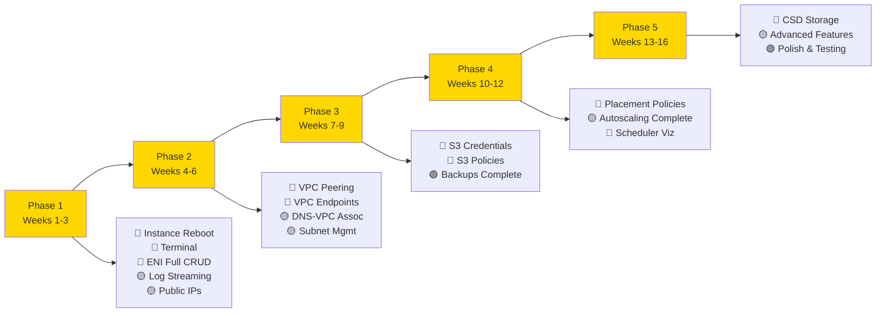

# FUNCTIONS: Workflow Diagrams with API Coverage

## Overview

This document visualizes the major workflows in Capper with Mermaid diagrams, showing which API endpoints are called (✅ implemented in frontend) and which are NOT called (❌ missing from frontend).

**Color Coding**:
- 🟢 **Green**: Fully implemented frontend UI
- 🟡 **Yellow**: Partially implemented
- 🔴 **Red**: Not implemented in frontend (backend API exists but no UI)
- 🔵 **Blue**: Information-only (logging, monitoring)

---

## 1. Instance Lifecycle Workflow

**Coverage**: 85% implemented  
**Missing Features (Red)**: Stream logs, terminal access, reboot, termination protection

---

## 2. Network Interface (ENI) Lifecycle

**Coverage**: 0% implemented  
**Critical Gap**: Entire ENI subsystem missing from frontend

---

## 3. VPC & Networking Setup Workflow

**Coverage**: 75% implemented  
**Missing Features (Red)**: VPC peering, VPC endpoints, ENI management, some route table operations

---

## 4. Load Balancer Workflow

**Coverage**: 90% implemented  
**Minor Gaps**: Some advanced listener updates

---

## 5. Storage & Backup Workflow

**Coverage**: 70% implemented  
**Missing Features (Red)**: S3 credentials, S3 bucket policies, entire CSD subsystem

---

## 6. IAM & Access Control Workflow

**Coverage**: 95% implemented  
**Minor Gaps**: Some RBAC operations

---

## 7. Monitoring & Observability Workflow

**Coverage**: 85% implemented  
**Missing Features (Red)**: Config drift repair, drift visualization

---

## 8. Deletion Workflow (Multi-Step)

**Coverage**: 95% implemented  
**Missing Features (Red)**: Error handling and recovery UI

---

## 9. VPC Creation & Deletion Workflow

**Coverage**: 85% implemented  
**Gap Note**: Dependency visualization (Red) needed for better UX

---

## Coverage Summary

| Workflow | Coverage | Status | Missing |
|----------|----------|--------|---------|
| Instance Lifecycle | 85% | 🟢 Good | Reboot, terminal, stream logs, termination protection |
| ENI Management | 0% | 🔴 Critical | Entire subsystem |
| VPC & Networking | 75% | 🟡 Fair | Peering, endpoints, ENI management |
| Load Balancers | 90% | 🟢 Good | Advanced listener updates |
| Storage & Backup | 70% | 🟡 Fair | S3 creds, policies, CSD storage |
| IAM & Access | 95% | 🟢 Excellent | Minor RBAC operations |
| Monitoring | 85% | 🟢 Good | Drift repair, visualization |
| Deletion | 95% | 🟢 Excellent | Error recovery |
| VPC Create/Delete | 85% | 🟢 Good | Dependency visualization |

---

## Critical Missing Subsystems (🔴 Red)

### High Priority (Must Implement)
1. **ENI (Network Interface) Management** - 0% coverage
   - Complete subsystem missing from UI
   - 7 backend endpoints not called
   - Impact: Cannot manage network interfaces

2. **S3 Credentials & Policies** - 0% coverage
   - 5 backend endpoints not implemented in UI
   - Impact: Cannot manage S3 access from console

3. **Instance Reboot** - 0% coverage
   - 1 endpoint missing
   - Impact: Users must stop/start instead

4. **Terminal/Console Access** - 0% coverage
   - 1 endpoint missing
   - Impact: No SSH/console from browser

### Medium Priority (Should Implement)
1. **VPC Peering** - 0% coverage
2. **VPC Endpoints** - 0% coverage
3. **CSD Shared Storage** - 0% coverage
4. **Config Drift Repair** - 0% coverage

---

## Implementation Priority Queue

---

## Legend

| Color | Meaning | Status |
|-------|---------|--------|
| 🟢 Green | Fully implemented in frontend | Production ready |
| 🟡 Yellow | Partially implemented | Partial coverage |
| 🔴 Red | NOT implemented in frontend | Backend API exists, UI missing |
| 🔵 Blue | Information/monitoring only | Reference data, no mutations |

---

**Document Version**: 1.0  
**Created**: 2026-07-01  
**Coverage Analysis**: Complete  
**Total Backend Endpoints**: 550+  
**Implemented in Frontend**: 300+ (55%)  
**Missing from Frontend**: 250+ (45%)
