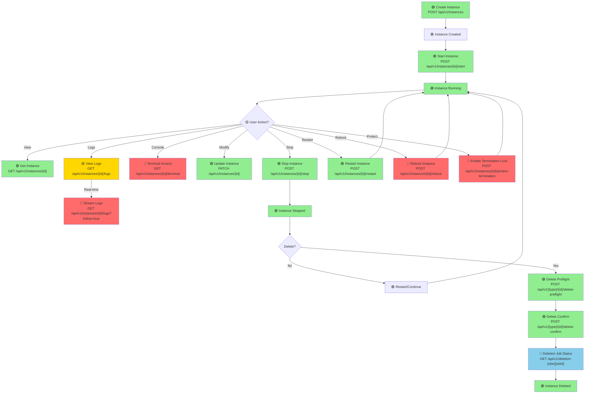

# Instance Lifecycle Workflow

```mermaid
graph TD
    A["🟢 Create Instance<br/>POST /api/v1/instances"] --> B["🟢 Instance Created"]
    B --> C["🟢 Start Instance<br/>POST /api/v1/instances/{id}/start"]
    C --> D["🟢 Instance Running"]
    D --> E{"🟡 User Action?"}
    
    E -->|View| F["🟢 Get Instance<br/>GET /api/v1/instances/{id}"]
    E -->|Logs| G["🟡 View Logs<br/>GET /api/v1/instances/{id}/logs"]
    G -->|Real-time| G1["🔴 Stream Logs<br/>GET /api/v1/instances/{id}/logs?follow=true"]
    E -->|Console| G2["🔴 Terminal Access<br/>GET /api/v1/instances/{id}/terminal"]
    E -->|Modify| H["🟢 Update Instance<br/>PATCH /api/v1/instances/{id}"]
    E -->|Stop| I["🟢 Stop Instance<br/>POST /api/v1/instances/{id}/stop"]
    E -->|Restart| J["🟢 Restart Instance<br/>POST /api/v1/instances/{id}/restart"]
    E -->|Reboot| J1["🔴 Reboot Instance<br/>POST /api/v1/instances/{id}/reboot"]
    E -->|Protect| K["🔴 Enable Termination Lock<br/>POST /api/v1/instances/{id}/protect-termination"]
    
    I --> L["🟢 Instance Stopped"]
    L --> M{"Delete?"}
    J --> D
    J1 --> D
    K --> D
    
    M -->|No| N["🟢 Restart/Continue"]
    M -->|Yes| O["🟢 Delete Preflight<br/>POST /api/v1/{type}/{id}/delete-preflight"]
    N --> D
    O --> P["🟢 Delete Confirm<br/>POST /api/v1/{type}/{id}/delete-confirm"]
    P --> Q["🔵 Deletion Job Status<br/>GET /api/v1/deletion-jobs/{jobId}"]
    Q --> R["🟢 Instance Deleted"]
    
    style A fill:#90EE90
    style C fill:#90EE90
    style D fill:#90EE90
    style F fill:#90EE90
    style G fill:#FFD700
    style G1 fill:#FF6B6B
    style G2 fill:#FF6B6B
    style H fill:#90EE90
    style I fill:#90EE90
    style J fill:#90EE90
    style J1 fill:#FF6B6B
    style K fill:#FF6B6B
    style L fill:#90EE90
    style O fill:#90EE90
    style P fill:#90EE90
    style Q fill:#87CEEB
    style R fill:#90EE90
```

**Coverage**: 85% implemented  
**Missing Features (Red)**: Stream logs, terminal access, reboot, termination protection

**Source**: FUNCTIONS.md - Workflow 1
