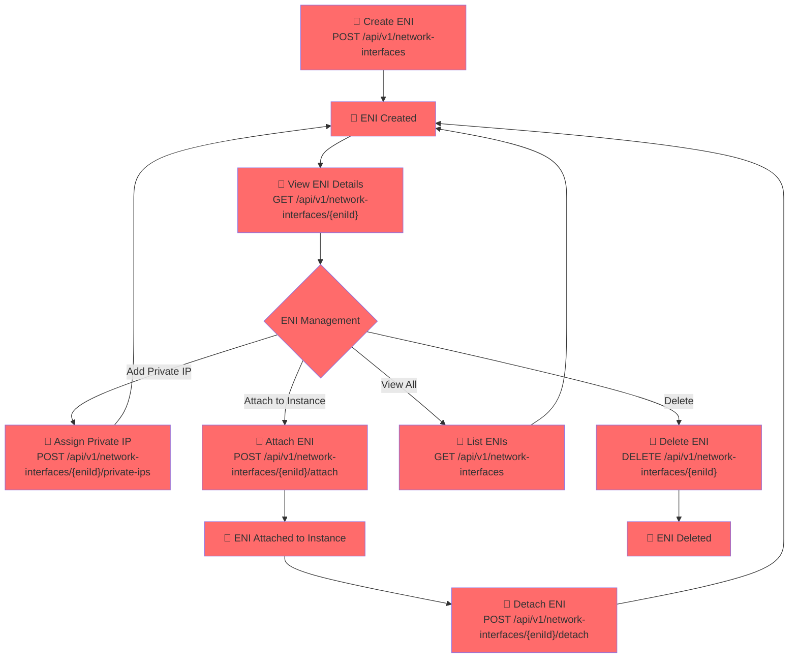

# Network Interface (ENI) Lifecycle

```mermaid
graph TD
    A["🔴 Create ENI<br/>POST /api/v1/network-interfaces"] --> B["🔴 ENI Created"]
    B --> C["🔴 View ENI Details<br/>GET /api/v1/network-interfaces/{eniId}"]
    C --> D{"ENI Management"}
    
    D -->|Add Private IP| E["🔴 Assign Private IP<br/>POST /api/v1/network-interfaces/{eniId}/private-ips"]
    D -->|Attach to Instance| F["🔴 Attach ENI<br/>POST /api/v1/network-interfaces/{eniId}/attach"]
    D -->|View All| G["🔴 List ENIs<br/>GET /api/v1/network-interfaces"]
    D -->|Delete| H["🔴 Delete ENI<br/>DELETE /api/v1/network-interfaces/{eniId}"]
    
    F --> I["🔴 ENI Attached to Instance"]
    I --> J["🔴 Detach ENI<br/>POST /api/v1/network-interfaces/{eniId}/detach"]
    J --> B
    
    E --> B
    G --> B
    H --> K["🔴 ENI Deleted"]
    
    style A fill:#FF6B6B
    style B fill:#FF6B6B
    style C fill:#FF6B6B
    style D fill:#FF6B6B
    style E fill:#FF6B6B
    style F fill:#FF6B6B
    style G fill:#FF6B6B
    style H fill:#FF6B6B
    style I fill:#FF6B6B
    style J fill:#FF6B6B
    style K fill:#FF6B6B
```

**Coverage**: 0% implemented  
**Critical Gap**: Entire ENI subsystem missing from frontend

**Source**: FUNCTIONS.md - Workflow 2
