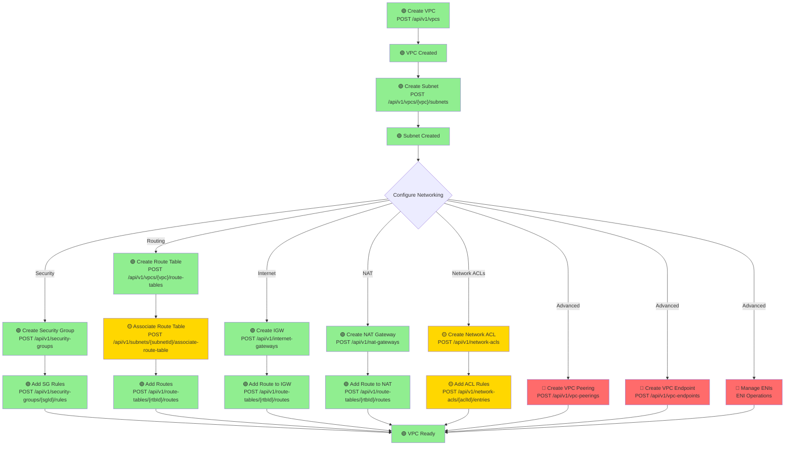

# VPC & Networking Setup Workflow

```mermaid
graph TD
    A["🟢 Create VPC<br/>POST /api/v1/vpcs"] --> B["🟢 VPC Created"]
    B --> C["🟢 Create Subnet<br/>POST /api/v1/vpcs/{vpc}/subnets"]
    C --> D["🟢 Subnet Created"]
    D --> E{"Configure Networking"}
    
    E -->|Security| F["🟢 Create Security Group<br/>POST /api/v1/security-groups"]
    F --> F1["🟢 Add SG Rules<br/>POST /api/v1/security-groups/{sgId}/rules"]
    
    E -->|Routing| G["🟢 Create Route Table<br/>POST /api/v1/vpcs/{vpc}/route-tables"]
    G --> G1["🟡 Associate Route Table<br/>POST /api/v1/subnets/{subnetId}/associate-route-table"]
    G1 --> G2["🟢 Add Routes<br/>POST /api/v1/route-tables/{rtbId}/routes"]
    
    E -->|Internet| H["🟢 Create IGW<br/>POST /api/v1/internet-gateways"]
    H --> H1["🟢 Add Route to IGW<br/>POST /api/v1/route-tables/{rtbId}/routes"]
    
    E -->|NAT| I["🟢 Create NAT Gateway<br/>POST /api/v1/nat-gateways"]
    I --> I1["🟢 Add Route to NAT<br/>POST /api/v1/route-tables/{rtbId}/routes"]
    
    E -->|Network ACLs| J["🟡 Create Network ACL<br/>POST /api/v1/network-acls"]
    J --> J1["🟡 Add ACL Rules<br/>POST /api/v1/network-acls/{aclId}/entries"]
    
    E -->|Advanced| K["🔴 Create VPC Peering<br/>POST /api/v1/vpc-peerings"]
    E -->|Advanced| L["🔴 Create VPC Endpoint<br/>POST /api/v1/vpc-endpoints"]
    E -->|Advanced| M["🔴 Manage ENIs<br/>ENI Operations"]
    
    F1 --> N["🟢 VPC Ready"]
    G2 --> N
    H1 --> N
    I1 --> N
    J1 --> N
    K --> N
    L --> N
    M --> N
    
    style A fill:#90EE90
    style B fill:#90EE90
    style C fill:#90EE90
    style D fill:#90EE90
    style F fill:#90EE90
    style F1 fill:#90EE90
    style G fill:#90EE90
    style G1 fill:#FFD700
    style G2 fill:#90EE90
    style H fill:#90EE90
    style H1 fill:#90EE90
    style I fill:#90EE90
    style I1 fill:#90EE90
    style J fill:#FFD700
    style J1 fill:#FFD700
    style K fill:#FF6B6B
    style L fill:#FF6B6B
    style M fill:#FF6B6B
    style N fill:#90EE90
```

**Coverage**: 75% implemented  
**Missing Features (Red)**: VPC peering, VPC endpoints, ENI management

**Source**: FUNCTIONS.md - Workflow 3
