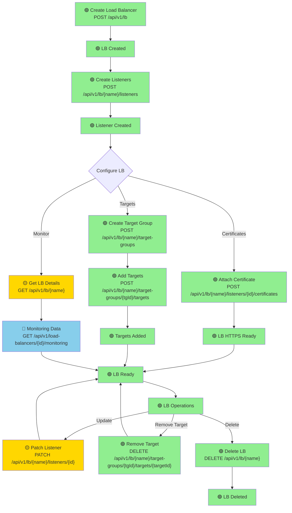

# Load Balancer Workflow

```mermaid
graph TD
    A["🟢 Create Load Balancer<br/>POST /api/v1/lb"] --> B["🟢 LB Created"]
    B --> C["🟢 Create Listeners<br/>POST /api/v1/lb/{name}/listeners"]
    C --> D["🟢 Listener Created"]
    D --> E{"Configure LB"}
    
    E -->|Certificates| F["🟢 Attach Certificate<br/>POST /api/v1/lb/{name}/listeners/{id}/certificates"]
    F --> F1["🟢 LB HTTPS Ready"]
    
    E -->|Targets| G["🟢 Create Target Group<br/>POST /api/v1/lb/{name}/target-groups"]
    G --> H["🟢 Add Targets<br/>POST /api/v1/lb/{name}/target-groups/{tgId}/targets"]
    H --> I["🟢 Targets Added"]
    
    E -->|Monitor| J["🟡 Get LB Details<br/>GET /api/v1/lb/{name}"]
    J --> K["🔵 Monitoring Data<br/>GET /api/v1/load-balancers/{id}/monitoring"]
    
    F1 --> L["🟢 LB Ready"]
    I --> L
    K --> L
    
    L --> M["🟢 LB Operations"]
    M -->|Update| N["🟡 Patch Listener<br/>PATCH /api/v1/lb/{name}/listeners/{id}"]
    M -->|Remove Target| O["🟢 Remove Target<br/>DELETE /api/v1/lb/{name}/target-groups/{tgId}/targets/{targetId}"]
    M -->|Delete| P["🟢 Delete LB<br/>DELETE /api/v1/lb/{name}"]
    
    N --> L
    O --> L
    P --> Q["🟢 LB Deleted"]
    
    style A fill:#90EE90
    style B fill:#90EE90
    style C fill:#90EE90
    style D fill:#90EE90
    style F fill:#90EE90
    style F1 fill:#90EE90
    style G fill:#90EE90
    style H fill:#90EE90
    style I fill:#90EE90
    style J fill:#FFD700
    style K fill:#87CEEB
    style L fill:#90EE90
    style M fill:#90EE90
    style N fill:#FFD700
    style O fill:#90EE90
    style P fill:#90EE90
    style Q fill:#90EE90
```

**Coverage**: 90% implemented  
**Minor Gaps**: Some advanced listener updates

**Source**: FUNCTIONS.md - Workflow 4
