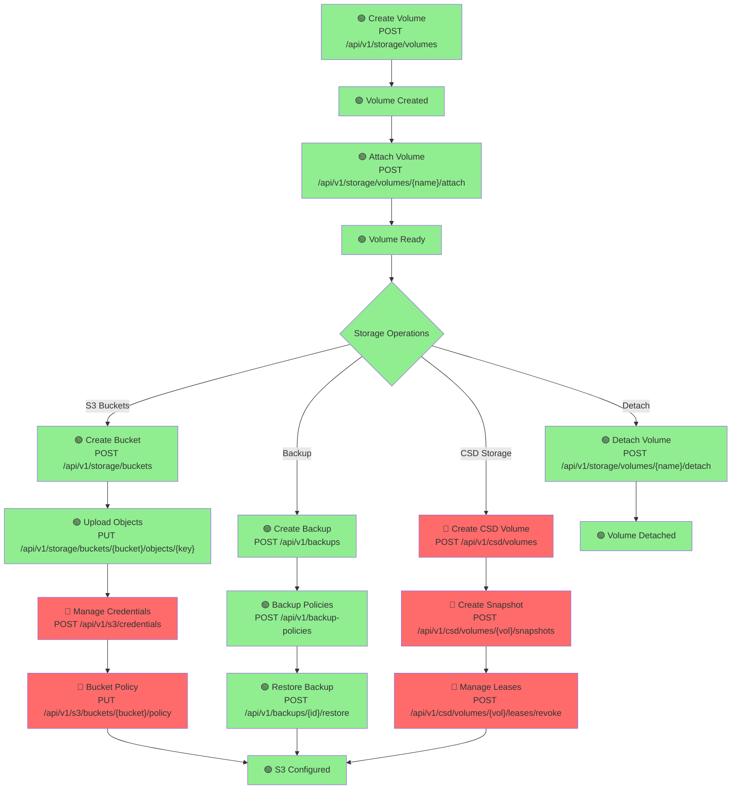

# Storage & Backup Workflow

```mermaid
graph TD
    A["🟢 Create Volume<br/>POST /api/v1/storage/volumes"] --> B["🟢 Volume Created"]
    B --> C["🟢 Attach Volume<br/>POST /api/v1/storage/volumes/{name}/attach"]
    C --> D["🟢 Volume Ready"]
    D --> E{"Storage Operations"}
    
    E -->|S3 Buckets| F["🟢 Create Bucket<br/>POST /api/v1/storage/buckets"]
    F --> F1["🟢 Upload Objects<br/>PUT /api/v1/storage/buckets/{bucket}/objects/{key}"]
    F1 --> F2["🔴 Manage Credentials<br/>POST /api/v1/s3/credentials"]
    F2 --> F3["🔴 Bucket Policy<br/>PUT /api/v1/s3/buckets/{bucket}/policy"]
    
    E -->|Backup| G["🟢 Create Backup<br/>POST /api/v1/backups"]
    G --> H["🟢 Backup Policies<br/>POST /api/v1/backup-policies"]
    H --> I["🟢 Restore Backup<br/>POST /api/v1/backups/{id}/restore"]
    
    E -->|CSD Storage| J["🔴 Create CSD Volume<br/>POST /api/v1/csd/volumes"]
    J --> J1["🔴 Create Snapshot<br/>POST /api/v1/csd/volumes/{vol}/snapshots"]
    J1 --> J2["🔴 Manage Leases<br/>POST /api/v1/csd/volumes/{vol}/leases/revoke"]
    
    E -->|Detach| K["🟢 Detach Volume<br/>POST /api/v1/storage/volumes/{name}/detach"]
    K --> L["🟢 Volume Detached"]
    
    F3 --> M["🟢 S3 Configured"]
    I --> M
    J2 --> M
    
    style A fill:#90EE90
    style B fill:#90EE90
    style C fill:#90EE90
    style D fill:#90EE90
    style E fill:#90EE90
    style F fill:#90EE90
    style F1 fill:#90EE90
    style F2 fill:#FF6B6B
    style F3 fill:#FF6B6B
    style G fill:#90EE90
    style H fill:#90EE90
    style I fill:#90EE90
    style J fill:#FF6B6B
    style J1 fill:#FF6B6B
    style J2 fill:#FF6B6B
    style K fill:#90EE90
    style L fill:#90EE90
    style M fill:#90EE90
```

**Coverage**: 70% implemented  
**Missing Features (Red)**: S3 credentials, S3 bucket policies, entire CSD subsystem

**Source**: FUNCTIONS.md - Workflow 5
