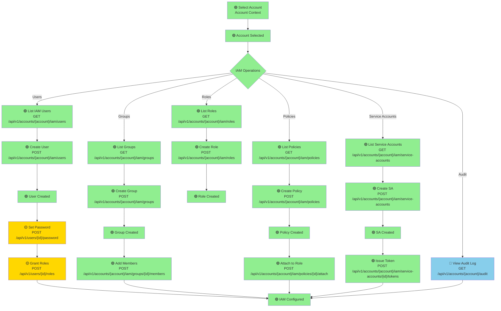

# IAM & Access Control Workflow

```mermaid
graph TD
    A["🟢 Select Account<br/>Account Context"] --> B["🟢 Account Selected"]
    B --> C{"IAM Operations"}
    
    C -->|Users| D["🟢 List IAM Users<br/>GET /api/v1/accounts/{account}/iam/users"]
    D --> E["🟢 Create User<br/>POST /api/v1/accounts/{account}/iam/users"]
    E --> F["🟢 User Created"]
    F --> F1["🟡 Set Password<br/>POST /api/v1/users/{id}/password"]
    F1 --> F2["🟡 Grant Roles<br/>POST /api/v1/users/{id}/roles"]
    
    C -->|Groups| G["🟢 List Groups<br/>GET /api/v1/accounts/{account}/iam/groups"]
    G --> H["🟢 Create Group<br/>POST /api/v1/accounts/{account}/iam/groups"]
    H --> I["🟢 Group Created"]
    I --> I1["🟢 Add Members<br/>POST /api/v1/accounts/{account}/iam/groups/{id}/members"]
    
    C -->|Roles| J["🟢 List Roles<br/>GET /api/v1/accounts/{account}/iam/roles"]
    J --> K["🟢 Create Role<br/>POST /api/v1/accounts/{account}/iam/roles"]
    K --> L["🟢 Role Created"]
    
    C -->|Policies| M["🟢 List Policies<br/>GET /api/v1/accounts/{account}/iam/policies"]
    M --> N["🟢 Create Policy<br/>POST /api/v1/accounts/{account}/iam/policies"]
    N --> O["🟢 Policy Created"]
    O --> O1["🟢 Attach to Role<br/>POST /api/v1/accounts/{account}/iam/policies/{id}/attach"]
    
    C -->|Service Accounts| P["🟢 List Service Accounts<br/>GET /api/v1/accounts/{account}/iam/service-accounts"]
    P --> Q["🟢 Create SA<br/>POST /api/v1/accounts/{account}/iam/service-accounts"]
    Q --> R["🟢 SA Created"]
    R --> R1["🟢 Issue Token<br/>POST /api/v1/accounts/{account}/iam/service-accounts/{id}/tokens"]
    
    C -->|Audit| S["🔵 View Audit Log<br/>GET /api/v1/accounts/{account}/audit"]
    
    F2 --> T["🟢 IAM Configured"]
    I1 --> T
    O1 --> T
    R1 --> T
    S --> T
    
    style A fill:#90EE90
    style B fill:#90EE90
    style C fill:#90EE90
    style D fill:#90EE90
    style E fill:#90EE90
    style F fill:#90EE90
    style F1 fill:#FFD700
    style F2 fill:#FFD700
    style G fill:#90EE90
    style H fill:#90EE90
    style I fill:#90EE90
    style I1 fill:#90EE90
    style J fill:#90EE90
    style K fill:#90EE90
    style L fill:#90EE90
    style M fill:#90EE90
    style N fill:#90EE90
    style O fill:#90EE90
    style O1 fill:#90EE90
    style P fill:#90EE90
    style Q fill:#90EE90
    style R fill:#90EE90
    style R1 fill:#90EE90
    style S fill:#87CEEB
    style T fill:#90EE90
```

**Coverage**: 95% implemented  
**Minor Gaps**: Some RBAC operations

**Source**: FUNCTIONS.md - Workflow 6
