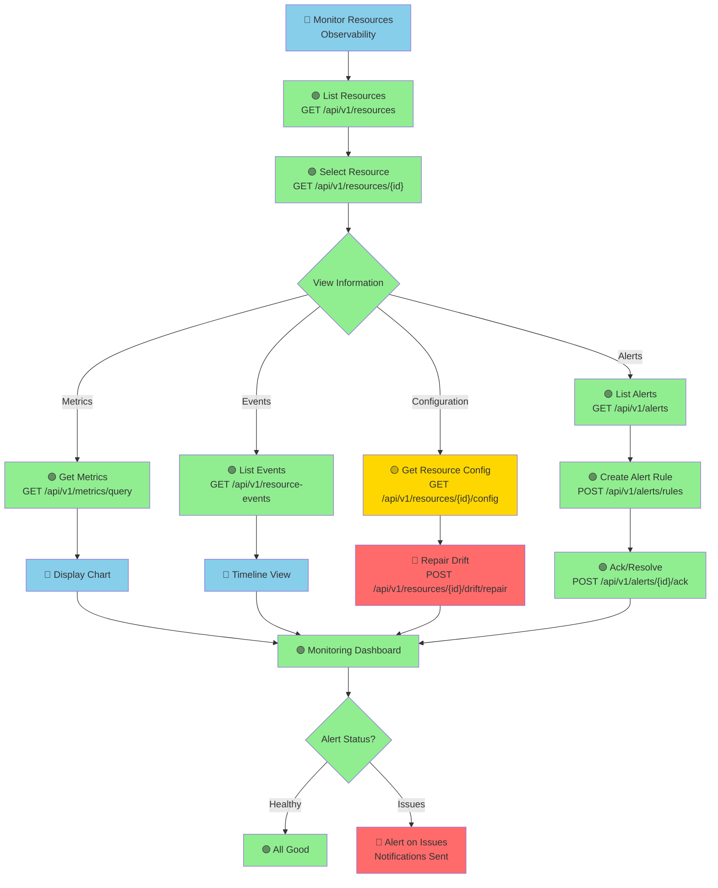

# Monitoring & Observability Workflow

```mermaid
graph TD
    A["🔵 Monitor Resources<br/>Observability"] --> B["🟢 List Resources<br/>GET /api/v1/resources"]
    B --> C["🟢 Select Resource<br/>GET /api/v1/resources/{id}"]
    C --> D{"View Information"}
    
    D -->|Metrics| E["🟢 Get Metrics<br/>GET /api/v1/metrics/query"]
    E --> E1["🔵 Display Chart"]
    
    D -->|Events| F["🟢 List Events<br/>GET /api/v1/resource-events"]
    F --> F1["🔵 Timeline View"]
    
    D -->|Configuration| G["🟡 Get Resource Config<br/>GET /api/v1/resources/{id}/config"]
    G --> G1["🔴 Repair Drift<br/>POST /api/v1/resources/{id}/drift/repair"]
    
    D -->|Alerts| H["🟢 List Alerts<br/>GET /api/v1/alerts"]
    H --> I["🟢 Create Alert Rule<br/>POST /api/v1/alerts/rules"]
    I --> I1["🟢 Ack/Resolve<br/>POST /api/v1/alerts/{id}/ack"]
    
    E1 --> J["🟢 Monitoring Dashboard"]
    F1 --> J
    G1 --> J
    I1 --> J
    
    J --> K{"Alert Status?"}
    K -->|Healthy| L["🟢 All Good"]
    K -->|Issues| M["🔴 Alert on Issues<br/>Notifications Sent"]
    
    style A fill:#87CEEB
    style B fill:#90EE90
    style C fill:#90EE90
    style D fill:#90EE90
    style E fill:#90EE90
    style E1 fill:#87CEEB
    style F fill:#90EE90
    style F1 fill:#87CEEB
    style G fill:#FFD700
    style G1 fill:#FF6B6B
    style H fill:#90EE90
    style I fill:#90EE90
    style I1 fill:#90EE90
    style J fill:#90EE90
    style K fill:#90EE90
    style L fill:#90EE90
    style M fill:#FF6B6B
```

**Coverage**: 85% implemented  
**Missing Features (Red)**: Config drift repair, drift visualization

**Source**: FUNCTIONS.md - Workflow 7
