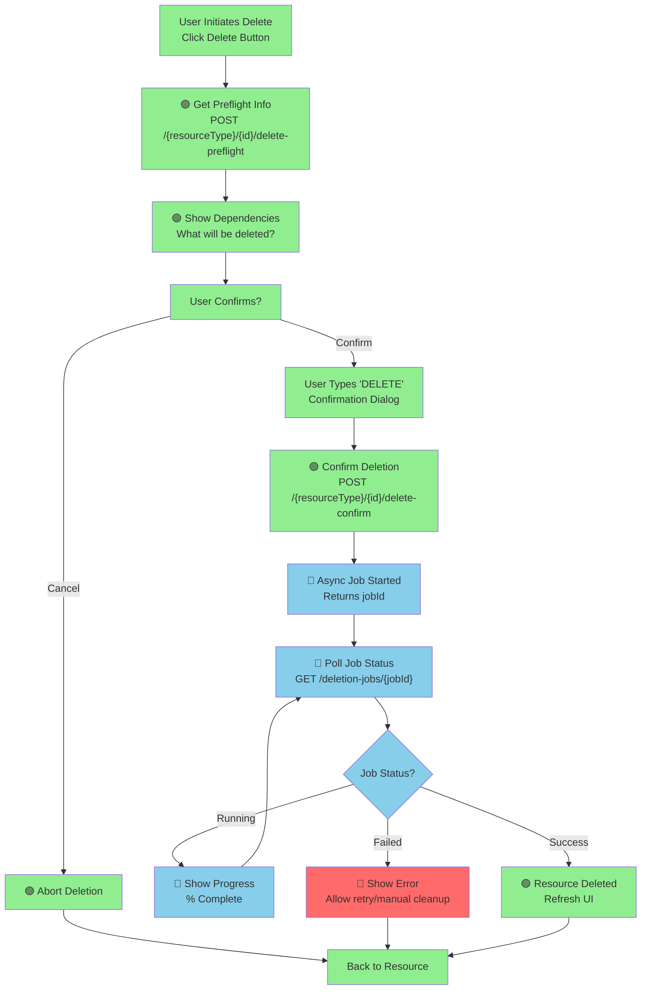

# Deletion Workflow (Multi-Step)

```mermaid
graph TD
    A["User Initiates Delete<br/>Click Delete Button"] --> B["🟢 Get Preflight Info<br/>POST /{resourceType}/{id}/delete-preflight"]
    B --> C["🟢 Show Dependencies<br/>What will be deleted?"]
    C --> D["User Confirms?"]
    
    D -->|Cancel| E["🟢 Abort Deletion"]
    D -->|Confirm| F["User Types 'DELETE'<br/>Confirmation Dialog"]
    
    F --> G["🟢 Confirm Deletion<br/>POST /{resourceType}/{id}/delete-confirm"]
    G --> H["🔵 Async Job Started<br/>Returns jobId"]
    
    H --> I["🔵 Poll Job Status<br/>GET /deletion-jobs/{jobId}"]
    I --> J{"Job Status?"}
    
    J -->|Running| K["🔵 Show Progress<br/>% Complete"]
    K --> I
    
    J -->|Failed| L["🔴 Show Error<br/>Allow retry/manual cleanup"]
    J -->|Success| M["🟢 Resource Deleted<br/>Refresh UI"]
    
    E --> N["Back to Resource"]
    L --> N
    M --> N
    
    style A fill:#90EE90
    style B fill:#90EE90
    style C fill:#90EE90
    style D fill:#90EE90
    style E fill:#90EE90
    style F fill:#90EE90
    style G fill:#90EE90
    style H fill:#87CEEB
    style I fill:#87CEEB
    style J fill:#87CEEB
    style K fill:#87CEEB
    style L fill:#FF6B6B
    style M fill:#90EE90
    style N fill:#90EE90
```

**Coverage**: 95% implemented  
**Missing Features (Red)**: Error handling and recovery UI

**Source**: FUNCTIONS.md - Workflow 8
