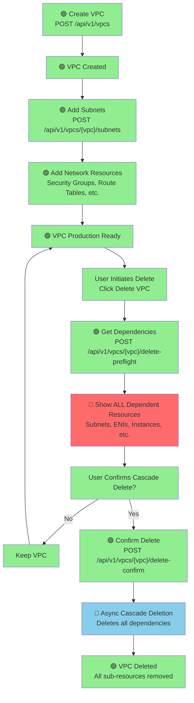

# VPC Creation & Deletion Workflow

```mermaid
graph TD
    A["🟢 Create VPC<br/>POST /api/v1/vpcs"] --> B["🟢 VPC Created"]
    B --> C["🟢 Add Subnets<br/>POST /api/v1/vpcs/{vpc}/subnets"]
    C --> D["🟢 Add Network Resources<br/>Security Groups, Route Tables, etc."]
    D --> E["🟢 VPC Production Ready"]
    
    E --> F["User Initiates Delete<br/>Click Delete VPC"]
    F --> G["🟢 Get Dependencies<br/>POST /api/v1/vpcs/{vpc}/delete-preflight"]
    G --> H["🔴 Show ALL Dependent Resources<br/>Subnets, ENIs, Instances, etc."]
    H --> I["User Confirms Cascade Delete?"]
    
    I -->|No| J["Keep VPC"]
    I -->|Yes| K["🟢 Confirm Delete<br/>POST /api/v1/vpcs/{vpc}/delete-confirm"]
    
    J --> E
    K --> L["🔵 Async Cascade Deletion<br/>Deletes all dependencies"]
    L --> M["🟢 VPC Deleted<br/>All sub-resources removed"]
    
    style A fill:#90EE90
    style B fill:#90EE90
    style C fill:#90EE90
    style D fill:#90EE90
    style E fill:#90EE90
    style F fill:#90EE90
    style G fill:#90EE90
    style H fill:#FF6B6B
    style I fill:#90EE90
    style J fill:#90EE90
    style K fill:#90EE90
    style L fill:#87CEEB
    style M fill:#90EE90
```

**Coverage**: 85% implemented  
**Gap Note**: Dependency visualization (Red) needed for better UX

**Source**: FUNCTIONS.md - Workflow 9
