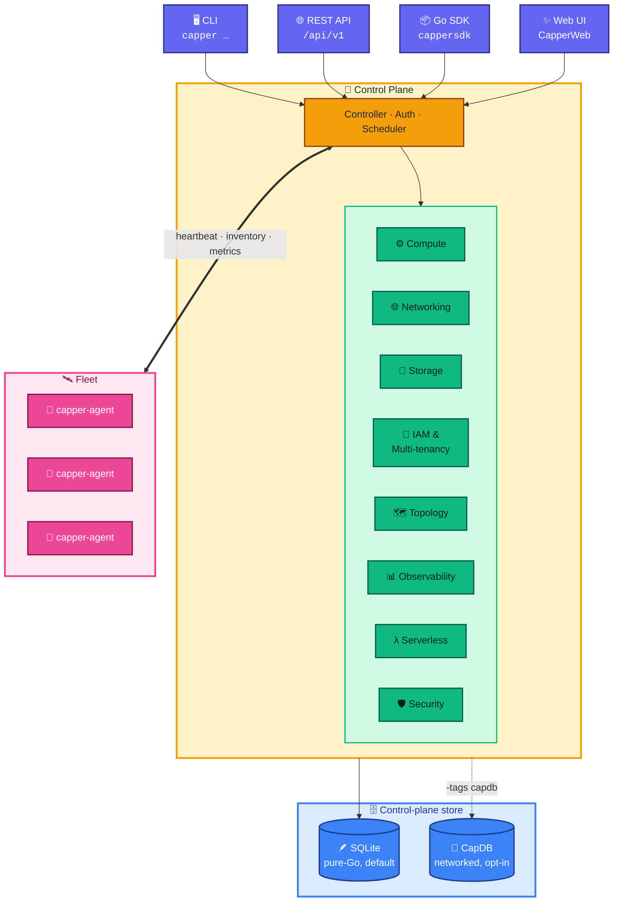

<div align="center">

# 🚀 Capper

### A self-hosted, multi-tenant cloud control plane — in a single binary

*Compute · Networking · Storage · Identity · Topology · Serverless · Observability*
*…driven by one control plane, reachable from a CLI, REST API, Go SDK, and Web UI.*


</div>

---

> [!WARNING]
> **Do not run untrusted `.cap` images with Capper v0.** This is experimental
> software — treat capsule isolation as best-effort, not a security boundary.

Capper started as a local `.cap` capsule runner and grew into a full platform:
compute, networking, storage, identity, topology, certificates, observability,
serverless, and public IP management — all behind one control plane, exposed
identically across **four interfaces**.

## 🏗️ Architecture



## 🧩 Subsystems

| Area | What it provides |
|---|---|
| ⚙️ **Compute** | `.cap` capsule instances (bwrap/chroot/crun/runc), images, templates, instance types, GPU inventory, compute groups + autoscale |
| 🌐 **Networking** | virtual networks, VPCs + subnets, firewalls, load balancers, DNS, ingress, **Public IPAM / Elastic IPs** |
| 💾 **Storage** | block volumes, S3-compatible object store, snapshots, CSD shared/replicated volumes, backups |
| 🔐 **Multi-tenancy** | organizations → accounts → projects, IAM (users/groups/roles/policies), managed policies, assume-role, quotas, governance, audit |
| 🗺️ **Topology** | realms → regions → zones → nodes, node pools, service roles, the `capper-agent` daemon, placement scheduler |
| 🚚 **VPC Mobility** | plan → approve → execute → cutover migration of VPC workloads across realms/regions |
| 📜 **Certificates** | ACME / Let's Encrypt issuance, renewal scheduler, bindings, internal CA |
| 📊 **Observability** | unified resource inventory, config drift, metrics, resource events, alerts |
| λ **Serverless** | Lambda-style **Functions** (triggers, invocations) and managed **MCP servers** with per-tool IAM + approval gates |
| 🛡️ **Security** | KMS, secrets, image posture scanning, SBOM, marketplace review |

> [!NOTE]
> Every subsystem is exposed **consistently across all four interfaces** (CLI,
> REST API, Go SDK, Web UI) and is covered by tests.

## 🔌 Interfaces

- **CLI** — `capper <subsystem> <verb>` (e.g. `capper instances list`, `capper org create`, `capper fn invoke`). Run `capper --help`.
- **REST API** — `capper api start` serves `/api/v1/…` with bearer-token auth.
- **Go SDK** — `import cappersdk "capper/sdk/go"` → `c := cappersdk.New(url, token)`; groups include `c.Instances`, `c.IAM`, `c.Functions`, `c.IPAM`, and ~40 more.
- **Web UI** — **CapperWeb** (Vite + React), served via `capper api start --console <dist>`.

## ⚡ Quick start

<details open>
<summary><b>Run a capsule</b></summary>

```bash
sh examples/alpine/bootstrap.sh
go run ./cmd/capper --store /tmp/capper-alpine create alpine.cap examples/alpine/capper.json
go run ./cmd/capper --store /tmp/capper-alpine run alpine.cap
go run ./cmd/capper --store /tmp/capper-alpine list instances
```

> [!TIP]
> Capper prefers Bubblewrap (`bwrap`) with unprivileged user namespaces and falls
> back to chroot (may need `sudo`). Choose with `--runtime bwrap|chroot|crun|runc`,
> and cap resources with `--memory 128M --cpu-time 60 --file-size 16M`.

</details>

<details>
<summary><b>Run the control plane</b></summary>

```bash
make capper-run            # builds a fresh bundle into capper-run/, serves http://127.0.0.1:8687
make capper-run-status
make capper-run-stop

# overrides
CAPPER_RUN_API_ADDR=127.0.0.1:8690 make capper-run
CAPPER_RUN_CONSOLE=/path/to/CapperWeb/dist make capper-run   # serve the Web UI

# …or start the API directly
capper api start --listen 127.0.0.1:8686 --console /path/to/CapperWeb/dist
```

</details>

<details>
<summary><b>All-in-one node</b></summary>

```bash
capper aio init --backend capdb   # storage layout + local topology + TLS + units
capper aio up                     # start API, daemon, and local services
capper aio status
capper aio upgrade --channel stable   # seamless, auto-rollback upgrades
```

</details>

<details>
<summary><b>Join a worker node</b></summary>

```bash
capper node join my-node --token <join-token> --address 10.0.0.5 --role compute
capper node approve my-node        # on the control plane
```

The `capper-agent` daemon (`cmd/capper-agent`) sends heartbeats, reports inventory
and version, pushes host metrics, and supervises services.

</details>

## 🗄️ Storage backend

By default Capper persists control-plane state in a single embedded **SQLite**
database (`modernc.org/sqlite`, WAL + busy timeout) — pure-Go, no external process.

For networked, connection-pooled storage it can instead talk to **CapDB** — a
SQLite fork with a TLS client/server protocol and a native pool, maintained at
[rickcollette/CapDB](https://github.com/rickcollette/CapDB) and consumed via
`CAPDB_DIR`. It keeps the SQLite dialect, so no SQL changes are needed.

```bash
make capdb-fetch          # clone/update the CapDB engine
make capdb                # build the client lib + server
go build -tags capdb ./cmd/capper
make test-capdb           # driver conformance suite
```

See [`docs/src/operator-guide/capdb-backend.md`](docs/src/operator-guide/capdb-backend.md).

## 🛠️ Build & test

```bash
make build                # stamped binaries into bin/
go test ./...
go vet ./...
cd ../CapperWeb && npm run build   # Web UI
```

## 📚 Documentation

Operator and concept docs live under [`docs/`](docs/) (built with the toolchain in
`docs/config.yml` + `docs/nav.yml`). Start with the
[Upgrades guide](docs/src/operator-guide/upgrades.md) and the
[CapDB backend](docs/src/operator-guide/capdb-backend.md).

<div align="center">

---

*Built with Go 🐹 · React ⚛️ · SQLite/CapDB 🗄️ — self-hosted, single-binary, multi-tenant.*

</div>
